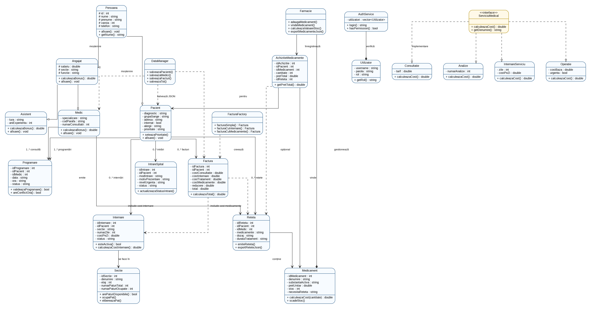

# Sistem de gestiune spital


Proiectul reprezintă o aplicație de tip **Hospital Management System**, realizată pentru gestionarea activităților principale dintr-un spital: pacienți, medici, programări, internări, rețete, facturi și farmacie. Logica principală este construită în **C++**, folosind principiile programării orientate pe obiecte, iar partea vizuală este realizată în **HTML, CSS și JavaScript**.

Aplicația este gândită pe roluri, astfel încât fiecare utilizator să vadă doar modulele necesare activității sale: administrator, medic, recepție și farmacie.

---

## Cuprins

- [Funcționalități principale](#funcționalități-principale)
- [Roluri și acces](#roluri-și-acces)
- [Diagrama UML](#diagrama-uml)
- [Structura proiectului](#structura-proiectului)
- [Clase importante](#clase-importante)
- [Fișiere JSON](#fișiere-json)
- [Date de test](#date-de-test)
- [Rulare aplicație web cu salvare în JSON](#rulare-aplicație-web-cu-salvare-în-json)
- [Rulare aplicație C++](#rulare-aplicație-c)
- [Observații despre salvarea datelor](#observații-despre-salvarea-datelor)
- [Autor](#autor)

---

## Funcționalități principale

Aplicația permite gestionarea următoarelor module:

| Modul | Descriere |
|---|---|
| Dashboard | Afișează o imagine generală asupra activității spitalului. |
| Pacienți | Permite vizualizarea și adăugarea pacienților. |
| Medici | Permite administrarea medicilor și crearea conturilor de logare pentru medici. |
| Programări | Gestionează consultațiile dintre pacienți și medici. |
| Internări | Evidențiază pacienții internați, secția, perioada și costul internării. |
| Rețete | Permite prescrierea medicamentelor din farmacie și calcularea costului medicamentelor. |
| Facturi | Calculează automat costurile pentru consultație, internare, tratament și medicamente. |
| Farmacie | Permite gestionarea medicamentelor și a stocurilor. |
| Raport | Afișează date statistice și informații sintetice despre activitatea spitalului. |
| Despre | Pagina de prezentare a proiectului, vizibilă doar pentru administrator. |

---

## Roluri și acces

Aplicația are autentificare pe roluri. Fiecare rol are acces doar la paginile necesare.

| Rol | Acces principal |
|---|---|
| Admin | Acces complet la modulele aplicației, inclusiv Medici și Despre. |
| Medic | Vede pacienții și informațiile asociate medicului logat. |
| Recepție | Poate adăuga pacienți, crea programări și gestiona internări. |
| Farmacie | Are acces doar la modulul Farmacie, pentru adăugarea și gestionarea medicamentelor. |

### Conturi de test

```text
admin / admin123
receptie / receptie123
farmacie / farmacie123
medic1 / medic123
medic2 / medic123
medic3 / medic123
medic4 / medic123
medic5 / medic123
```

---

## Diagrama UML

Diagrama UML evidențiază structura principală a proiectului și relațiile dintre clase. Aceasta include clasele pentru persoane, pacienți, angajați, medici, programări, internări, rețete, facturi, farmacie și autentificare.



> Varianta SVG a diagramei se află în `docs/Diagrama_UML_Gestiune_Spital.svg`.

---

## Structura proiectului

```text
HospitalManagement/
│
├── data/                    # Fișiere JSON și CSV cu datele aplicației
│   ├── medici.json
│   ├── pacienti.json
│   ├── users.json
│   ├── programari.json
│   ├── internari.json
│   ├── retete.json
│   ├── facturi.json
│   ├── medicamente.json
│   └── export/
│
├── docs/                    # Documentație și diagrama UML
│   ├── documentatie.md
│   ├── Diagrama_UML_Gestiune_Spital.png
│   └── Diagrama_UML_Gestiune_Spital.svg
│
├── src/                     # Clasele C++ ale proiectului
│   ├── Pacient.h / Pacient.cpp
│   ├── Medic.h / Medic.cpp
│   ├── Programare.h / Programare.cpp
│   ├── Internare.h / Internare.cpp
│   ├── Reteta.h / Reteta.cpp
│   ├── Factura.h / Factura.cpp
│   ├── Farmacie.h / Farmacie.cpp
│   ├── Medicament.h / Medicament.cpp
│   ├── AuthService.h / AuthService.cpp
│   └── main.cpp
│
├── web/                     # Interfața web
│   ├── login.html
│   ├── dashboard.html
│   ├── pacienti.html
│   ├── medici.html
│   ├── programari.html
│   ├── internari.html
│   ├── retete.html
│   ├── facturi.html
│   ├── farmacie.html
│   ├── raport.html
│   ├── style.css
│   └── script.js
│
├── tests/                   # Teste C++
├── server.js                # Server Node.js pentru salvare în JSON
├── start_server_windows.bat # Pornire rapidă server pe Windows
├── package.json             # Comandă npm start
├── Makefile                 # Comenzi pentru compilare/rulare
└── README.md                # Prezentarea proiectului
```

---

## Clase importante

### `Persoana`
Clasă de bază pentru entitățile care au date personale, precum nume, prenume, vârstă sau date de contact.

### `Pacient`
Reprezintă pacientul spitalului. Conține date personale, diagnostic, prioritate și statutul internării.

### `Angajat`
Clasă de bază pentru personalul spitalului.

### `Medic`
Moștenește clasa `Angajat` și conține informații despre specializare, experiență și pacienții asociați.

### `Programare`
Gestionează consultațiile dintre pacienți și medici, incluzând data, ora și statusul programării.

### `Internare`
Stochează informații despre secție, perioada internării, tipul salonului și costul internării.

### `Reteta`
Conține medicamentele prescrise pacientului și calculează costul total al medicamentelor.

### `Factura`
Calculează costul final al serviciilor medicale, incluzând consultația, internarea, tratamentul, medicamentele și reducerea.

### `Farmacie`
Gestionează lista de medicamente, stocurile și prețurile.

### `Medicament`
Reprezintă un medicament disponibil în farmacie, cu denumire, preț și stoc.

### `AuthService`
Gestionează autentificarea utilizatorilor și rolurile acestora.

### `DataManager`
Asigură încărcarea și salvarea datelor în fișiere JSON.

---

## Fișiere JSON

Aplicația folosește fișiere JSON pentru stocarea și afișarea datelor în interfața web.

| Fișier | Rol |
|---|---|
| `users.json` | Conturile utilizatorilor și rolurile acestora. |
| `medici.json` | Lista medicilor. |
| `pacienti.json` | Lista pacienților. |
| `programari.json` | Programările pacienților la medici. |
| `internari.json` | Date despre internările pacienților. |
| `retete.json` | Rețetele și medicamentele prescrise. |
| `facturi.json` | Facturile generate pentru pacienți. |
| `medicamente.json` | Medicamentele disponibile în farmacie. |
| `statistici.json` | Date statistice pentru dashboard și raport. |

---

## Date de test

Proiectul conține date inițiale pentru prezentare:

- **5 medici diferiți**;
- **10 pacienți diferiți**;
- conturi separate pentru medicii de test;
- medicamente disponibile în farmacie;
- exemple de programări, internări, rețete și facturi.

Aceste date ajută la demonstrarea funcționalităților aplicației fără a introduce manual toate informațiile de la început.

---

## Rulare aplicație web cu salvare în JSON

Pentru ca datele adăugate din interfața web să se salveze permanent în fișierele din folderul `data/*.json`, aplicația trebuie pornită prin serverul local Node.js inclus în proiect.

### Pași pe Windows

1. Instalează **Node.js** de pe site-ul oficial, dacă nu este deja instalat.
2. Dezarhivează proiectul.
3. Intră în folderul principal al proiectului:

```text
HospitalManagement
```

4. Deschide terminalul în acest folder. Poți face click dreapta în folder și alegi:

```text
Open in Terminal
```

5. Pornește serverul. Varianta cea mai simplă este să dai dublu click pe:

```text
start_server_windows.bat
```

Sau poți porni serverul din terminal:

```powershell
npm start
```

sau:

```powershell
node server.js
```

6. Deschide aplicația în browser la adresa:

```text
http://localhost:8080/login.html
```

După acești pași, modificările făcute în web se salvează automat în fișierele JSON. De exemplu, dacă adaugi un medic nou din pagina **Medici**, acesta va fi scris în:

```text
data/medici.json
```

Dacă adaugi un pacient nou, acesta va fi scris în:

```text
data/pacienti.json
```

### Ce se salvează în JSON

Serverul salvează automat datele pentru:

| Modul | Fișier JSON actualizat |
|---|---|
| Utilizatori / logare | `data/users.json` |
| Medici | `data/medici.json` |
| Pacienți | `data/pacienti.json` |
| Programări | `data/programari.json` |
| Internări | `data/internari.json` |
| Rețete | `data/retete.json` |
| Facturi | `data/facturi.json` |
| Farmacie | `data/medicamente.json` |
| Achiziții medicamente | `data/achizitii_medicamente.json` |
| Statistici | `data/statistici.json` |
| Raport | `data/raport_spital.json` |

### Important

Nu deschide proiectul direct prin dublu click pe `login.html` dacă vrei salvare în JSON. Deschiderea directă în browser folosește doar `localStorage`, iar fișierele `.json` nu pot fi modificate direct de browser.

Corect pentru salvare în JSON:

```text
http://localhost:8080/login.html
```

Greșit pentru salvare permanentă în JSON:

```text
file:///.../HospitalManagement/web/login.html
```

### Resetarea datelor salvate în browser

Dacă în aplicație apar date vechi, acestea pot fi salvate în `localStorage`. Pentru resetare:

1. Deschide aplicația în browser.
2. Apasă `F12`.
3. Intră la `Console`.
4. Rulează comanda:

```javascript
localStorage.clear()
```

5. Reîncarcă pagina cu `Ctrl + F5`.

---

## Rulare aplicație C++ pe Windows

Proiectul poate fi rulat pe Windows în două moduri: direct prin executabilul deja inclus sau prin compilare în terminal.

### Varianta 1: rulare rapidă cu executabilul inclus

1. Descarcă și dezarhivează proiectul.
2. Intră în folderul:

```text
HospitalManagement
```

3. Deschide fișierul:

```text
hospital_app.exe
```

Aceasta este cea mai simplă variantă, deoarece nu mai trebuie să compilezi proiectul manual.

### Varianta 2: rulare din Command Prompt sau PowerShell

1. Deschide folderul proiectului `HospitalManagement`.
2. Click dreapta într-un spațiu liber din folder.
3. Alege:

```text
Open in Terminal
```

sau deschide manual **PowerShell** / **Command Prompt** în folderul proiectului.

4. Rulează comanda:

```powershell
.\hospital_app.exe
```

### Varianta 3: compilare pe Windows cu MinGW

Dacă vrei să compilezi proiectul din codul sursă, trebuie să ai instalat **MinGW** sau **MSYS2** cu compilatorul `g++`.

După instalare, verifică în terminal:

```powershell
g++ --version
```

Dacă apare versiunea compilatorului, poți compila proiectul.

#### Compilare simplă cu g++

Din folderul `HospitalManagement`, rulează:

```powershell
g++ src\*.cpp -o hospital_app.exe
```

Apoi pornește aplicația:

```powershell
.\hospital_app.exe
```

#### Compilare cu mingw32-make

Dacă ai instalat `mingw32-make`, poți folosi:

```powershell
mingw32-make clean
mingw32-make
.\hospital_app.exe
```

Dacă apare eroarea:

```text
mingw32-make : The term 'mingw32-make' is not recognized
```

înseamnă că MinGW nu este adăugat în variabila de sistem **PATH** sau nu este instalat complet. În această situație, folosește varianta cu executabilul deja inclus sau instalează MinGW/MSYS2 și adaugă folderul `bin` în PATH.

---

## Rulare aplicație web pe Windows

Pentru partea web se recomandă rularea cu **Node.js**, deoarece această variantă salvează automat datele noi în fișierele `.json`.

### Varianta recomandată: rulare cu Node.js și salvare în JSON

Din folderul principal al proiectului `HospitalManagement`, poți porni serverul prin dublu click pe:

```text
start_server_windows.bat
```

Sau din terminal:

```powershell
npm start
```

sau direct:

```powershell
node server.js
```

Apoi deschide în browser:

```text
http://localhost:8080/login.html
```

În această variantă, datele adăugate din web se salvează permanent în folderul `data/`.

### Varianta simplă: deschidere directă în browser

Poți deschide și direct:

```text
HospitalManagement/web/login.html
```

Această variantă este utilă doar pentru prezentare rapidă. Datele noi se salvează în browser, nu în fișierele JSON.

---

## Observații despre salvarea datelor

În proiect a fost adăugat fișierul `server.js`, care funcționează ca un mic backend local. Acesta primește datele trimise din interfața web și le scrie în fișierele JSON din folderul `data/`.

Fluxul de salvare este următorul:

```text
Web form → JavaScript → server.js → data/*.json
```

Astfel, dacă adaugi un medic, pacient, medicament, internare, rețetă sau factură, modificarea rămâne salvată în proiect.

---

## Caracteristici POO folosite

Proiectul utilizează concepte specifice programării orientate pe obiecte:

- **clase și obiecte**;
- **moștenire**, de exemplu `Medic` derivă din `Angajat`;
- **încapsulare**, prin atribute private și metode publice;
- **asociere între clase**, de exemplu pacient-programare, pacient-rețetă, pacient-factură;
- **separarea responsabilităților**, prin clase dedicate pentru autentificare, date, facturi și farmacie.

---

## Autor

Proiect realizat pentru disciplina **Programare Orientată pe Obiecte**, având ca temă dezvoltarea unei aplicații pentru gestiunea unui spital.

