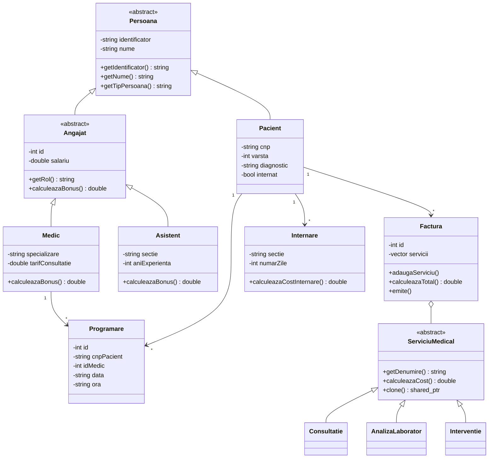

# Documentatie proiect - Gestiune Spital

## Descriere

Aplicatia modeleaza activitatea unui spital: pacienti, angajati medicali, programari, internari si facturi. Proiectul foloseste concepte de Programare Orientata pe Obiecte in C++ si include o interfata web separata pentru prezentarea datelor exportate in JSON.

## Clase principale

- `Pacient`: retine CNP, nume, varsta, diagnostic si starea de internare.
- `Persoana`: clasa abstracta de baza pentru pacienti si angajati.
- `Angajat`: mosteneste `Persoana` si este clasa abstracta pentru personalul medical.
- `Medic`: mosteneste `Angajat`, adauga specializare si tarif de consultatie.
- `Asistent`: mosteneste `Angajat`, adauga sectie si ani de experienta.
- `Programare`: retine pacientul, medicul, data, ora, motivul si statusul.
- `ServiciuMedical`: clasa abstracta folosita pentru calcul polimorfic.
- `Consultatie`, `AnalizaLaborator`, `Interventie`: servicii concrete cu formule diferite de cost.
- `Factura`: contine servicii medicale si calculeaza totalul.
- `FacturaFactory`: creeaza facturi standard, urgente sau cu reducere pentru studenti.
- `Internare`: functionalitate adaugata; calculeaza costul internarii dupa numarul de zile.
- `SpitalService`: gestioneaza colectiile si filtrarea pacientilor.
- `JsonStorage`: exporta snapshot-ul aplicatiei in JSON.
- `Logger`: singleton pentru operatiuni critice.

## Concepte POO folosite

### Incapsulare

Atributele claselor sunt private sau protected. Accesul la date se face prin metode publice, de exemplu `getDiagnostic()`, `setInternat()` sau `calculeazaTotal()`.

### Mostenire

`Pacient` si `Angajat` mostenesc din clasa abstracta `Persoana`, unde se afla datele comune: identificator si nume. `Medic` si `Asistent` mostenesc clasa abstracta `Angajat`. Astfel, persoanele din sistem au atribute comune, iar personalul medical isi defineste propriul rol si bonus.

### Polimorfism

`Factura` stocheaza pointeri catre `ServiciuMedical`. La calculul totalului, metoda virtuala `calculeazaCost()` este apelata diferit pentru consultatii, analize si interventii.

### Exceptii personalizate

Sunt definite exceptii pentru situatii invalide:

- `ProgramareInvalidaException`
- `FacturaInvalidaException`
- `EntitateNegasitaException`

### STL

Proiectul foloseste `std::vector`, `std::string`, `std::shared_ptr`, algoritmi din `<algorithm>` si fisiere prin `std::ofstream`.

### Factory Pattern

`FacturaFactory` separa logica de creare a facturilor de restul aplicatiei. Acest lucru permite adaugarea usoara a unor tipuri noi de facturi.

## Diagrama UML simplificata



## Testare

Testele sunt in folderul `tests/` si pot fi rulate cu:

```bash
make test
```

Sunt verificate:

- crearea unei programari valide
- respingerea unei ore invalide
- imposibilitatea anularii unei programari finalizate
- calculul facturilor cu reducere
- calculul interventiilor urgente
- blocarea modificarilor dupa emiterea facturii

## Posibile imbunatatiri

- persistenta JSON completa cu incarcare din fisier
- autentificare pentru roluri diferite
- CRUD complet in interfata web
- generarea automata a facturilor PDF
- integrare cu o baza de date
